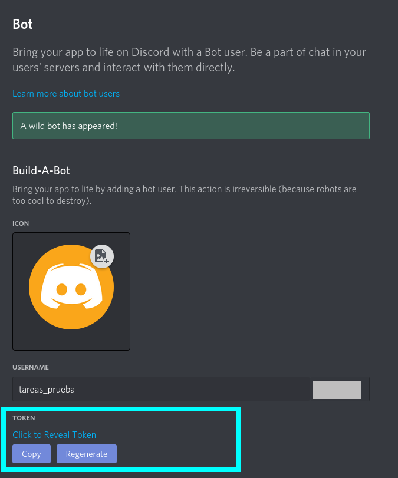
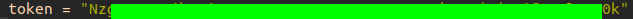

## Tabla de contenidos
* [Información general](#información-general)
* [Requisitos](#requisitos)
* [Setup](#setup)
* [Funcionamiento y comandos](#funcionamiento-y-comandos)

## Información general
Bot de Discord para administrar tareas y fechas de entrega.
	
## Requisitos
* Python 3.5.3 +
* [Pyrebase](https://github.com/thisbejim/Pyrebase)
* [Discord.py](https://pypi.org/project/discord.py/)
	
## Setup
### 1. Obtener token para el bot de discord

1.1 Ve a https://discord.com/developers/applications y haz clic en "nueva aplicación".

1.2 Asigna un nombre a la aplicación y da clic en "crear".

1.3 En el menú lateral, en la sección de "ajustes", da clic en el botón "bot".

1.4 Selecciona "añadir bot" y selecciona "si" en la ventana emergente.

1.5 Da clic en "revelar token" y colócalo entre comillas en el archivo config.py.

### 2. Añade el bot a tu server de discord

2.1 En el menú lateral, en la sección de "ajustes", da clic en el botón "oauth2".

2.2 Marca las casillas como se muesta en la imagen.

2.3 Entra al link para autorizar el bot, selecciona tu server y haz clic en "continuar" y después en "autorizar".

### 3. Añade tu base de datos al bot de discord

3.1 Ve a https://firebase.google.com y haz clic en "comenzar".

3.2 Haz clic en "agregar proyecto".

3.3 Asigna un nombre y da clic en "continuar".

3.4 En la siguiente pantalla, da clic en "continuar".

3.5 En la sección "elige una cuenta de google analytics", selecciona la cuenta por defecto de firebase.

3.6 En el menú lateral, selecciona "realtime database" y después "crear una base de datos".

3.7 En "opciones de base de datos", en "ubicación" selecciona "estados unidos" y después da clic en "siguiente".

3.8 En "reglas de seguridad", selecciona cualquiera de las dos opciones y después da clic en "habilitar".

3.9 Dirigete a la pestaña de "reglas".

3.10 En el apartado "editar reglas", modifica las reglas como se muestra en la imagen y da clic en "publicar".

3.11 En el menú lateral, da clic en el ícono de ajustes y después en "configuración del proyecto".

3.12 En la sección de apps, selecciona el ícono de web.

3.13 Asigna un nombre a la app y da clic en "Registrar App".

3.14 Coloca la configuración firebaseConfig en el archivo config.py, formateado entre comillas como se muestra en la imagen.

3.15 Da clic en "ir a consola".

### 4. Añade el canal al que quieres mandar los mensajes

4.1 En la aplicación de discord, haz clic en el ícono de ajustes.

4.2 En la barra lateral, en la sección de "ajustes de la aplicación", haz clic en "apariencia".

4.3 En los ajustes avanzados, asegurate de tener activado el "modo desarrollador".

4.4 Haz clic derecho en el canal en donde quieras recibir los mensajes del bot y selecciona "copiar id".

4.5 Coloca el id entre comillas en el archivo config.py.

### 5. Correr el programa main.py.

## Funcionamiento y comandos

### Calendario

Consiste de la descripción de cada tarea y su fecha de entrega. El calendario se despliega usando el comando **_.cal_**, y mostrará las tareas a entregar, enumeradas y ordenadas por fecha de entrega (empezando por la entrega más próxima).

### .n (nueva tarea)

Este comando permite añadir una nueva tarea al calendario, y se usa de la siguiente manera: **.n** _DD-MM-AAAA(fecha_de_entrega)_ **"**_descripción_de_la_tarea_**"**

Ejemplo: **.n** _12-02-2021_ _"Proyecto final"_ (Nótese el uso de comillas en la descripción de la tarea).

### .r (eliminar tarea)

Permite eliminar tareas del calendario. Toma como argumento el número que le corresponde a la tarea en el calendario. Se usa de la siguiente manera: **r.** _número_de_tarea_en_el_calendario_

Ejemplo: **.r** _2_

### .m (modificar tarea)

Modifica la descripción de una tarea existente en el calendario. Su sintaxis es: **.m** _número_de_tarea_en_el_calendario_ **"**_nueva_descripción_de_la_tarea_**"**

Ejemplo: **.m** _2_ _"Proyecto/Exámen final"_

### Recordatorios

Cada 24 horas (contando a partir del momento en que se inició el bot) se revisará si hay entregas pendientes para el día actual o el día siguiente, de ser así, estos serán mostrados en un mensaje.

